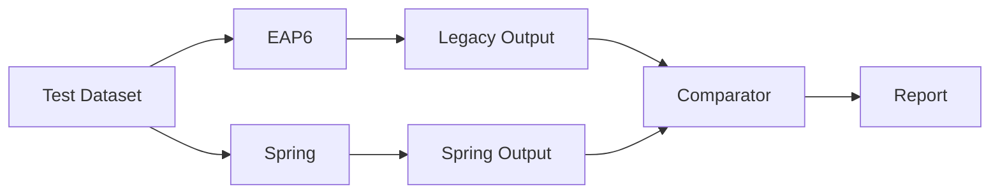

# Angular 20 Console (Standalone)

- Angular 20 standalone (no AppModule)
- Angular Material + AG Grid
- Sidebar collapsible + filters grid + results table + context menu
- Mocked data in `src/app/mock-data.ts`

## Run
```bash
npm i
npm start
```
Open http://localhost:4200/


https://www.ag-grid.com/angular-data-grid/context-menu/

import { Component } from '@angular/core';
import { HttpClient } from '@angular/common/http';
import { AgGridAngular } from 'ag-grid-angular';

import {
  CellSelectionOptions,
  CheckboxEditorModule,
  ClientSideRowModelModule,
  ColDef,
  DataTypeDefinition,
  DateEditorModule,
  GridApi,
  GridOptions,
  GridReadyEvent,
  ModuleRegistry,
  NumberEditorModule,
  TextEditorModule,
  ValidationModule,
  GetContextMenuItemsParams,
  MenuItemDef,
} from 'ag-grid-community';

import {
  CellSelectionModule,
  ClipboardModule,
  ColumnMenuModule,
  ContextMenuModule,
  ExcelExportModule,
  RowGroupingModule,
  RowGroupingPanelModule,
  SetFilterModule,
} from 'ag-grid-enterprise';

// 🔐 modules Enterprise / Community
ModuleRegistry.registerModules([
  NumberEditorModule,
  TextEditorModule,
  CheckboxEditorModule,
  DateEditorModule,
  ClientSideRowModelModule,
  ClipboardModule,
  ExcelExportModule,
  ColumnMenuModule,
  ContextMenuModule,
  CellSelectionModule,
  RowGroupingModule,
  SetFilterModule,
  RowGroupingPanelModule,
  ...(process.env.NODE_ENV !== 'production' ? [ValidationModule] : []),
]);

interface IOlympicData {
  athlete: string;
  age: number;
  gold: number;
  silver: number;
  date: string;
  country: string;
}

interface IOlympicDataTypes extends IOlympicData {
  dateObject: Date;
  hasGold: boolean;
  hasSilver: boolean;
  dateTime: Date;
  dateTimeString: string;
  countryObject: {
    name: string;
  };
}

@Component({
  selector: 'my-app',
  standalone: true,
  imports: [AgGridAngular],
  template: `
    <ag-grid-angular
      style="width: 100%; height: 100%;"
      class="ag-theme-quartz"
      [rowData]="rowData"
      [columnDefs]="columnDefs"
      [defaultColDef]="defaultColDef"
      [dataTypeDefinitions]="dataTypeDefinitions"
      [rowGroupPanelShow]="rowGroupPanelShow"
      [cellSelection]="cellSelection"
      [gridOptions]="gridOptions"
      (gridReady)="onGridReady($event)"
    />
  `,
})
export class AppComponent {
  columnDefs: ColDef[] = [
    // 🔹 Colonne d’actions avec icône (visible au hover)
    {
      headerName: '',
      field: 'actions',
      width: 60,
      pinned: 'left',
      suppressMenu: true,
      sortable: false,
      filter: false,
      resizable: false,
      cellRenderer: (params) => {
        const eDiv = document.createElement('div');
        eDiv.classList.add('action-cell');

        eDiv.innerHTML = `
          <button class="action-icon" title="Actions">
            <span class="material-icons">more_horiz</span>
          </button>
        `;

        const btn = eDiv.querySelector('button') as HTMLButtonElement;

        btn.addEventListener('click', (event) => {
          event.preventDefault();
          event.stopPropagation();

          // 👉 ouverture du menu contextuel AG Grid, ancré sur le bouton
          params.api.showContextMenu({
            anchorToElement: btn,
            rowNode: params.node,
            column: params.column,         // tu peux mettre une autre colonne si tu veux
            value: params.value,
          });
        });

        return eDiv;
      },
      cellClass: 'action-cell-wrapper',
    },

    { field: 'athlete' },
    { field: 'age', minWidth: 100 },
    { field: 'hasGold', minWidth: 100, headerName: 'Gold' },
    {
      field: 'hasSilver',
      minWidth: 100,
      headerName: 'Silver',
      cellRendererParams: { disabled: true },
    },
    { field: 'dateObject', headerName: 'Date' },
    { field: 'date', headerName: 'Date (String)' },
    {
      field: 'dateTime',
      headerName: 'DateTime',
      cellDataType: 'dateTime',
      minWidth: 250,
    },
    { field: 'dateTimeString', headerName: 'DateTime (String)', minWidth: 250 },
    { field: 'countryObject', headerName: 'Country' },
  ];

  defaultColDef: ColDef = {
    flex: 1,
    minWidth: 180,
    filter: true,
    floatingFilter: true,
    editable: true,
    enableRowGroup: true,
  };

  dataTypeDefinitions: { [cellDataType: string]: DataTypeDefinition } = {
    object: {
      baseDataType: 'object',
      extendsDataType: 'object',
      valueParser: (params) => ({ name: params.newValue }),
      valueFormatter: (params) =>
        params.value == null ? '' : params.value.name,
    },
  };

  rowGroupPanelShow: 'always' | 'onlyWhenGrouping' | 'never' = 'always';
  cellSelection: boolean | CellSelectionOptions = {
    handle: { mode: 'fill' },
  };

  rowData!: IOlympicDataTypes[];
  private gridApi!: GridApi<IOlympicDataTypes>;

  // 👉 GridOptions avec menu contextuel custom
  gridOptions: GridOptions<IOlympicDataTypes> = {
    getContextMenuItems: (params: GetContextMenuItemsParams) =>
      this.buildContextMenuItems(params),
  };

  constructor(private http: HttpClient) {}

  onGridReady(params: GridReadyEvent<IOlympicDataTypes>) {
    this.gridApi = params.api;

    this.http
      .get<IOlympicDataTypes[]>(
        'https://www.ag-grid.com/example-assets/olympic-winners.json',
      )
      .subscribe((data) => {
        this.rowData = data.map((rowData) => {
          const dateParts = rowData.date.split('/');
          const [year, month, day] = dateParts
            .reverse()
            .map((e) => parseInt(e, 10));
          const [h, m, s] = [
            Math.floor((window as any).agRandom() * 24),
            Math.floor((window as any).agRandom() * 60),
            Math.floor((window as any).agRandom() * 60),
          ];
          const padded = [month, day, h, m, s].map((e) =>
            e.toString().padStart(2, '0'),
          );
          const dateString = `${year}-${padded[0]}-${padded[1]}`;
          const dateTimeString = `${year}-${padded[0]}-${padded[1]}T${padded
            .slice(2)
            .join(':')}`;
          return {
            ...rowData,
            date: dateString,
            dateObject: new Date(year, month - 1, day),
            dateTimeString,
            dateTime: new Date(year, month - 1, day, h, m, s),
            countryObject: { name: rowData.country },
            hasGold: rowData.gold > 0,
            hasSilver: rowData.silver > 0,
          };
        });
      });
  }

  // 🚩 ici tu customises complètement le menu contextuel
  private buildContextMenuItems(
    params: GetContextMenuItemsParams,
  ): (MenuItemDef | string)[] {
    const row = params.node?.data;

    const customItems: (MenuItemDef | string)[] = [
      {
        name: 'Ouvrir fiche détaillée',
        icon: '<span class="material-icons">open_in_new</span>',
        action: () => {
          // 👉 ici tu appelles ta modale Angular
          alert('Ouvrir modale pour ' + row?.athlete);
        },
      },
      'separator',
      {
        name: 'Supprimer la ligne',
        icon: '<span class="material-icons">delete</span>',
        action: () => {
          params.api.applyTransaction({ remove: [row!] });
        },
      },
      'separator',
      // tu peux ajouter ici des items AG Grid natifs si tu veux les garder :
      'copy',
      'copyWithHeaders',
      'paste',
    ];

    return customItems;
  }
}
/* styles.scss ou global.css */

.ag-theme-quartz .action-cell-wrapper {
  display: flex;
  align-items: center;
  justify-content: center;
}

.action-icon {
  border: none;
  background: transparent;
  cursor: pointer;
  padding: 0;
  opacity: 0;
  transition: opacity 0.15s ease-in-out;
  display: flex;
  align-items: center;
  justify-content: center;
}

.ag-row-hover .action-icon {
  opacity: 1;
}

/* Si tu utilises Material Icons */
.material-icons {
  font-size: 18px;
}


"styles": [
  "node_modules/primeicons/primeicons.css",
  "node_modules/primeng/resources/primeng.css",
  "src/styles.scss"
]


"styles": [
  "node_modules/primeicons/primeicons.css",
  "node_modules/primeng/resources/primeng.css",

  // ⚠️ Le thème PrimeNG (light ou dark) — un seul à la fois idéalement
  "src/assets/primeng/lara-light-blue.theme.css",

  // ✅ Ton DS en dernier (tokens, overrides, components)
  "src/styles.scss"
]

import { Injectable } from '@angular/core';

@Injectable({ providedIn: 'root' })
export class ThemeService {
  setDark(isDark: boolean) {
    const link = document.getElementById('primeng-theme') as HTMLLinkElement;
    link.href = isDark
      ? 'assets/primeng/lara-dark-blue.theme.css'
      : 'assets/primeng/lara-light-blue.theme.css';

    document.documentElement.classList.toggle('dark', isDark);
  }
}

/* styles.scss */
:root.dark {
  /* variables à toi si besoin */
}

.custom-datetime .p-datepicker {
  border-radius: 12px;
}

/* Ajustements spécifiques en dark */
:root.dark .custom-datetime .p-datepicker {
  box-shadow: 0 10px 30px rgba(0, 0, 0, .4);
}

@Injectable({ providedIn: 'root' })
export class ThemeService {
  setDark(isDark: boolean) {
    const link = document.getElementById('primeng-theme') as HTMLLinkElement;
    link.href = isDark
      ? 'assets/primeng/lara-dark-blue.theme.css'
      : 'assets/primeng/lara-light-blue.theme.css';

    document.documentElement.classList.toggle('dark', isDark); // utile aussi pour TON CSS
  }
}

npm install primeng primeicons


Bonjour,

Dans le cadre des nouveaux développements en Spring Boot 3 (Jakarta EE), je souhaite signaler un point d’attention concernant la messagerie JMS.
Le broker HornetQ, basé sur javax.jms, est legacy et n’est pas compatible directement avec Spring Boot 3 (jakarta.jms).

Les applications existantes peuvent bien entendu rester inchangées.
Pour les nouveaux services, les options techniques envisagées sont :

migration progressive vers ActiveMQ Artemis (successeur officiel de HornetQ),

ou cohabitation HornetQ / Artemis via un bridge JMS.

Ce point est remonté à titre d’anticipation et d’alignement long terme.

Bien cordialement,


Architecture JMS – Migration progressive vers Spring Boot 3
------------------------------------------------------------

Monde legacy (Java EE / javax.jms) :
----------------------------------
[Applications existantes]
        |
        |  JMS (HornetQ client)
        v
   (HornetQ BROKER)
      - queues / topics
      - legacy, non maintenu
      - utilisé par JBoss EAP 6

Monde cible (Jakarta / Spring Boot 3) :
--------------------------------------
[Spring Boot 3 services]
        |
        |  JMS (Jakarta)
        v
   (ActiveMQ Artemis BROKER)
      - successeur officiel de HornetQ
      - compatible Spring Boot 3
      - cloud / OpenShift ready

Migration progressive :
-----------------------
(HornetQ) === bridge JMS ===> (Artemis)

- Les applications legacy restent inchangées
- Les nouveaux services Spring Boot 3 utilisent Artemis
- Le bridge permet une cohabitation sans rupture


Bonjour,

Dans le cadre de la migration progressive de certains composants vers **Spring Boot 3 (Jakarta EE)**, je souhaite partager un **point d’attention technique** concernant la messagerie JMS actuellement basée sur **HornetQ**.

### Contexte

* Spring Boot 3 repose sur **Jakarta EE** (`jakarta.jms.*`)
* HornetQ est un broker **legacy**, basé sur **Java EE / `javax.jms.*`**, et **n’est plus maintenu**
* Cette différence d’API rend l’utilisation directe du client HornetQ **non compatible** avec Spring Boot 3

### Impact identifié

* Une application Spring Boot 3 ne peut pas consommer/publier de messages HornetQ de manière fiable via le client HornetQ historique
* Le risque est principalement **technique (incompatibilité Jakarta / javax)**, plus que fonctionnel
* Les applications legacy existantes (JBoss EAP 6 / HornetQ) peuvent évidemment rester inchangées à court terme

### Options d’architecture envisageables

1. **Migration progressive vers ActiveMQ Artemis**

   * Artemis est le **successeur officiel de HornetQ**
   * Compatible Spring Boot 3 / Jakarta
   * Solution cible long terme, cloud-ready

2. **Cohabitation HornetQ / Artemis via un bridge**

   * Les applications legacy continuent à utiliser HornetQ
   * Les nouvelles applications Spring Boot 3 utilisent Artemis
   * Un bridge assure le transfert des messages entre brokers
   * Permet une migration incrémentale sans impact immédiat

3. **Alternative transitoire**

   * Maintien des applications JMS legacy sur leur stack actuelle
   * Les nouveaux services Spring Boot 3 s’intègrent via une approche découplée (ex. outbox / intégration asynchrone)

### Point important

Cette remarque n’implique **aucune urgence immédiate**, mais vise à :

* sécuriser les choix techniques pour les nouveaux développements
* éviter des blocages lors des futures montées de version
* aligner progressivement l’architecture avec les standards supportés à long terme

Je reste bien entendu disponible pour détailler ces points ou participer à une discussion d’architecture si nécessaire.

Bien cordialement,

Lead développeur Java / Spring / Messaging


| Élément       | HornetQ | ActiveMQ (classic) | Artemis | IBM MQ             |
| ------------- | ------- | ------------------ | ------- | ------------------ |
| Type          | Broker  | Broker             | Broker  | Broker             |
| JMS           | javax   | javax              | jakarta | javax / jakarta    |
| Spring Boot 3 | ❌       | ❌                  | ✅       | ⚠️ (client récent) |
| Statut        | ❌ Mort  | ⚠️ ancien          | ✅ Actif | ✅ Actif            |
| Cloud/K8s     | ❌       | ⚠️                 | ✅       | ⚠️                 |
| Licence       | Open    | Open               | Open    | 💰 Payant          |


On va démêler clairement tout ça, parce que beaucoup de gens mélangent JMS, HornetQ, ActiveMQ, IBM MQ alors que ce ne sont PAS la même chose.

Je vais te donner :

la différence fondamentale

un tableau comparatif

un schéma simple (visuel mental)

une règle claire pour ton contexte (Spring Boot 3 / migration)

1️⃣ La clé absolue à comprendre (1 phrase)

👉 JMS est une API (un contrat)
👉 HornetQ / ActiveMQ / Artemis / IBM MQ sont des BROKERS (implémentations)

💡 JMS ≠ broker

2️⃣ JMS : c’est QUOI exactement ?

JMS (Java Message Service) :

une API Java

définit des interfaces :

ConnectionFactory

Queue

Topic

Message

ne transporte aucun message tout seul

👉 JMS = “comment parler”
👉 Broker = “où les messages vivent”

3️⃣ Les brokers, un par un (clair et honnête)
🔴 HornetQ

Ancien broker Red Hat

Utilisé dans JBoss EAP 6

API : javax.jms

❌ Projet arrêté

❌ Incompatible Spring Boot 3

👉 Legacy pur

🟢 ActiveMQ “Classic”

Broker Apache historique

API : javax.jms

Fonctionnel mais ancien

Encore utilisé

👉 Ancien, mais pas mort

🟢 ActiveMQ Artemis

Successeur officiel de HornetQ

Broker moderne

API : jakarta.jms

Cloud / Kubernetes / OpenShift ready

Support Spring Boot 3

👉 Le choix moderne

🔵 IBM MQ (anciennement WebSphere MQ)

Broker IBM

Ultra robuste

Très utilisé en banque

API JMS fournie par IBM

Payant (licence)

👉 Le tank des brokers


*********************************chat gpt*************************************************
Guide d'utilisation + Prompt GitHub Copilot

Ce document contient :
- Les étapes à suivre (en français).
- Le prompt maître à donner à GitHub Copilot (en anglais).

Étapes à suivre (FR)

Ouvre ton projet dans VS Code avec GitHub Copilot Chat.

Colle le prompt ci-dessous dans une nouvelle conversation.

Demande à Copilot de réaliser uniquement la Phase 1 (analyse). Ne le laisse pas coder immédiatement.

Relis son analyse et valide-la.

Demande ensuite la proposition d'architecture de tests et les éventuels refactorings minimaux.

Demande l'implémentation de l'infrastructure de tests (Testcontainers Oracle + IBM MQ, profil Spring Boot, utilitaires de nettoyage...).

Demande à Copilot de structurer les tests par domaines et scénarios cohérents, avec des classes de test ciblées et des utilitaires partagés, plutôt que de créer une seule classe d’intégration gigantesque.

Demande ensuite les scénarios Happy Path.

Puis les scénarios Compliance (succès, HIT, NO_HIT, timeout, réponses invalides, doublons, retry, erreurs MQ...).

Puis les scénarios Debulk (en rappelant que la Compliance intervient avant le Debulk) et tous les cas métier découverts dans le code.

Enfin, demande les tests de concurrence, d'idempotence, de reprise après incident, de restart et les revues de qualité.

Après chaque étape, exige la compilation et l'exécution réelle des tests avant de continuer.

Master Prompt for GitHub Copilot (EN)

Act as a Principal Software Engineer and Software Architect specialized in Java 25, Spring Boot 4, IBM MQ, JMS, Quartz Scheduler, Oracle Database, OpenShift, distributed systems, asynchronous processing, JUnit 5, Testcontainers, Awaitility and enterprise banking applications.

First, inspect the existing codebase. Do NOT generate implementation immediately.

PHASE 1
- Understand the complete business workflow from the code.
- Identify every Quartz job, scheduler, MQ producer/consumer, JMS producer, routing component, business service, entity, repository, transaction boundary and state transition.
- Discover the complete business workflow yourself. Do not rely on user descriptions.
- Identify every possible business path including Compliance, Debulk, Routing and every alternative branch discovered in the code.

MAIN OBJECTIVE

Design and implement reliable integration tests covering the complete workflow.

Use:
- JUnit 5
- @SpringBootTest
- Testcontainers
- a real IBM MQ container
- a real Oracle Database container
- real Spring JMS infrastructure
- real JPA repositories and transactions
- Awaitility where asynchronous waiting is necessary

Do not replace IBM MQ or Oracle with in-memory alternatives.

Do not rely on Quartz cron timings.
Quartz should be disabled in the integration-test profile.
Business logic must be extracted from Quartz jobs into processors/services.
Quartz jobs should only delegate to processors such as:
- incomingMessageProcessor.processAvailableMessages()
- pendingMessageProcessor.processPendingMessages()
- complianceResponseProcessor.processAvailableResponses()

Review the architecture.
If business logic is inside Quartz Jobs, refactor it using clean separation of responsibilities.

Build reusable Testcontainers infrastructure:
- Oracle
- IBM MQ
- DynamicPropertySource (or Spring Boot 4 equivalent)
- Queue manager configuration
- JMS configuration
- Database migrations
- Deterministic cleanup

Use fixed Docker image versions.

Automatically discover and implement ALL business scenarios found in the code, including:
- Happy paths
- Compliance required/not required
- Compliance HIT
- Compliance NO_HIT
- Invalid compliance response
- Duplicate compliance response
- Unknown correlation id
- MQ failures
- Oracle failures
- Retry
- Restart
- Duplicate scheduler execution
- Duplicate incoming messages
- Debulk required
- Debulk not required
- Debulk failures
- Duplicate debulk
- Routing validation
- Every additional workflow discovered in the code

Remember: Compliance happens before Debulk. Infer the detailed business rules from the code instead of assuming them.

Assume a non-XA architecture.
Review transaction boundaries, idempotency, retry mechanisms and consistency gaps.
Evaluate SELECT FOR UPDATE SKIP LOCKED, optimistic/pessimistic locking, Spring Quartz clustering, unique constraints and recovery strategies where appropriate.

Assertions must verify:
- SWIFT payload
- JMS headers
- Correlation ID
- Business references
- Routing
- Destination queue
- Status transitions
- Retry counters
- Parent/child relationships
- Duplicate prevention

Use Awaitility only when asynchronous waiting is required.
Never use Thread.sleep().

Keep every test isolated by cleaning MQ queues and Oracle tables.

TEST SUITE ORGANIZATION AND CLEAN TEST ARCHITECTURE

The number of scenarios is expected to be significant. Do not place all integration scenarios in one giant test class.

After analyzing the codebase, design a clean and maintainable test architecture. Prefer multiple focused integration-test classes grouped by coherent business capability or technical responsibility. Example groupings may include:
- incoming message ingestion and Oracle persistence;
- compliance decision and request publishing;
- compliance response handling;
- Debulk processing after Compliance;
- final JMS routing;
- idempotency and duplicate handling;
- retry, recovery and restart scenarios;
- failure injection;
- Quartz clustering and concurrency.

These names are suggestions only. Adapt the final class and package organization to the actual project structure and terminology.

Create reusable test-support components where they remove duplication, for example:
- shared Testcontainers and Spring test configuration;
- IBM MQ queue provisioning and purge utilities;
- Oracle cleanup and database assertion helpers;
- SWIFT, Compliance and FIX fixture builders;
- JMS message readers and assertion helpers;
- workflow or scenario drivers that execute processors in a readable sequence;
- controlled failure-injection helpers.

Shared test-support code must not become another monolithic framework. Keep helpers focused, composable and explicit. Avoid a single "god" base class, deep test inheritance hierarchies, hidden global state and overly generic test DSLs.

A common abstract integration-test base class is acceptable only for true cross-cutting infrastructure such as container lifecycle, dynamic properties and deterministic cleanup. It must not contain business assertions or scenario-specific logic. Prefer composition over inheritance for business-oriented test helpers.

Use nested test classes only when they make one focused test class easier to read. Use parameterized tests for genuine scenario matrices, but do not force unrelated business paths into one parameterized method.

Each test class and test method must remain small enough to understand independently. Test names and steps should express the business scenario and the expected state transitions.

Before implementing the suite, propose the package structure, test-class boundaries and shared utility components. Explain why the selected organization avoids duplication without hiding the workflow.

Do not introduce Allure, Serenity, Cucumber, GraphWalker or another reporting/visualization framework at this stage. Focus first on correct, clean and maintainable integration tests.

Implement the solution as an expert Java 25 / Spring Boot 4 engineer.
Prefer constructor injection, immutable objects, AssertJ, parameterized tests and production-quality code.

Workflow:
1. Analyze
2. Explain
3. Propose architecture
4. Implement infrastructure
5. Implement happy-path tests
6. Implement remaining business scenarios
7. Compile
8. Execute tests
9. Fix failures
10. Review architecture and improve robustness

Never claim a test passes unless it has actually been executed.
Produce production-quality, deterministic and maintainable code.

Suggestions de briques techniques à laisser évaluer par Copilot (FR)

Important : ces éléments sont des suggestions, pas des choix imposés. Copilot doit d'abord analyser le projet, les contraintes de licence, les versions compatibles et l'environnement CI/OpenShift avant de les retenir.

Images de conteneurs : IBM MQ officielle depuis IBM Container Registry, Oracle Database Free pour les tests, et versions explicites plutôt que latest.

Testcontainers : modules JUnit 5, Oracle, GenericContainer ou module IBM MQ disponible dans la version utilisée, Network dédié, WaitStrategy et éventuellement reusable containers uniquement si cela ne nuit pas à l'isolation.

Initialisation IBM MQ : scripts MQSC montés dans le conteneur pour créer le Queue Manager, les channels, les queues, la DLQ et les autorisations nécessaires.

Initialisation Oracle : Flyway ou Liquibase selon ce que le projet utilise déjà, avec migrations de production réutilisées dans les tests.

Tests asynchrones : Awaitility avec délais explicites, réception JMS avec timeout court, jamais de Thread.sleep().

Nettoyage : purge contrôlée des files MQ, TRUNCATE/DELETE ordonné des tables Oracle, reset des hooks de panne et arrêt des triggers Quartz.

Injection de pannes : composants de test décorateurs autour des adapters MQ/DB, Toxiproxy pour les coupures réseau, ou mécanismes Testcontainers équivalents.

Concurrence : ExecutorService, CountDownLatch/CyclicBarrier, plusieurs ApplicationContext ou plusieurs instances applicatives conteneurisées si nécessaire pour simuler plusieurs pods.

Observabilité de test : collecte des logs, correlation IDs, métriques Micrometer et traces uniquement si le projet les utilise déjà.

Comparaison des messages : XMLUnit pour XML, JSONAssert/Jackson pour JSON, comparaison normalisée pour SWIFT/FIX et AssertJ pour les assertions métier.

Architecture de fixtures : builders/fixtures dédiés aux messages SWIFT, réponses Compliance et messages FIX issus du Debulk.

CI : exécution Docker-compatible, images pré-tirées si nécessaire, timeouts maîtrisés et séparation claire entre tests rapides et tests d'intégration lourds.

Technical Building Blocks to Consider (EN - add to the Copilot prompt)

### Spring Quartz coordination candidates

The project already uses Spring Quartz. Use the existing Spring Quartz stack for scheduler-level coordination and do not introduce a second scheduling-lock framework.

For scheduler-level coordination across multiple OpenShift pods, evaluate the existing Quartz configuration and consider, only where appropriate:

- a persistent JDBC JobStore using the project database or the dedicated Quartz schema;
- Quartz clustering with a shared database;
- unique Quartz instance identifiers for every pod;
- an appropriate cluster check-in interval and misfire threshold;
- recovery behavior for jobs interrupted by a failed pod;
- `@DisallowConcurrentExecution` when the same Quartz job must not overlap;
- durable jobs, triggers and misfire instructions aligned with the business requirements;
- explicit testing that two Quartz scheduler instances do not execute the same trigger concurrently when clustering is enabled.

Do not treat Quartz clustering as a replacement for database record claiming or message-publishing idempotency. Quartz coordinates job execution, while record locking and unique business constraints protect the business data and outbound MQ publication.

## Suggested technical building blocks — evaluate, do not impose

The following are examples of technical building blocks that may be useful. Treat them only as candidates.

Before selecting any of them, inspect the existing project, dependency management, licensing constraints, CI environment, OpenShift platform constraints, and version compatibility with Java 25 and Spring Boot 4.

Prefer existing project standards when they are sound. Do not introduce a new library merely because it is listed here.

### Container images

Consider, where appropriate:

- an official IBM MQ container image from IBM Container Registry;
- Oracle Database Free or another Oracle image already approved by the project;
- fixed, explicit image tags;
- no use of `latest`;
- digest pinning in CI if the organization requires reproducible builds.

Verify that the chosen image versions are legally usable, available in the target registry, and compatible with the CI environment.

### Testcontainers

Possible Testcontainers building blocks include:

- JUnit 5 Testcontainers integration;
- `OracleContainer` when compatible with the chosen image;
- an IBM MQ-specific Testcontainers module if it is stable and compatible with the project version;
- otherwise, `GenericContainer` for IBM MQ;
- a dedicated `Network` when containers must communicate using aliases;
- explicit `WaitStrategy` definitions for database readiness, MQ listener readiness and channel readiness;
- reusable containers only when they do not compromise deterministic isolation.

Do not rely only on a TCP port being open. Prefer a readiness check that proves the actual service is usable.

### IBM MQ provisioning

Consider provisioning IBM MQ through version-controlled MQSC scripts mounted into the test container.

The scripts may create and configure, according to project conventions:

- the Queue Manager;
- server-connection channels;
- application queues;
- compliance request and response queues;
- incoming SWIFT queues;
- final destination queues;
- error queues and dead-letter queues;
- channel authentication and permissions required by the test application.

Keep test MQ configuration close to the integration tests and avoid hidden manual setup.

### Oracle schema and migrations

Reuse the same schema migration mechanism as production whenever possible, for example:

- Flyway;
- Liquibase;
- project-specific migration scripts.

Do not create a simplified test-only schema that differs from production.

Validate indexes, unique constraints, foreign keys, locking behavior and database-specific SQL against a real Oracle instance.

### Spring Boot integration-test configuration

Possible options include:

- `@DynamicPropertySource`;
- Spring Boot service connections when they support the selected containers and project setup;
- a dedicated `application-integration-test.yml` profile;
- explicit disabling of Quartz auto-start;
- short JMS receive timeouts;
- dedicated transaction and retry properties for tests.

Choose the most idiomatic Spring Boot 4 mechanism supported by the actual dependency versions.

### Asynchronous test coordination

Consider:

- Awaitility with explicit maximum duration and polling intervals;
- JMS receive operations with controlled timeouts;
- latches or barriers only for precise concurrency tests;
- deterministic direct invocation of processors when the production trigger is Quartz.

Never use arbitrary `Thread.sleep(...)` calls.

### Message comparison and assertions

Depending on the actual message formats, consider:

- AssertJ for domain assertions;
- XMLUnit for XML comparison and canonicalization;
- Jackson tree comparison or JSONAssert for JSON;
- dedicated SWIFT normalization utilities;
- dedicated FIX message parsing and semantic field comparison;
- JMS header/property assertion helpers.

Do not compare structured messages with brittle raw string equality when ordering, whitespace, timestamps or generated identifiers are dynamic.

### Test-suite structure and support code

Because the workflow contains many business branches, avoid a single oversized integration-test class.

Evaluate a package structure similar to the following, adapting it to the project:

- `integration/incoming` for ingestion and persistence scenarios;
- `integration/compliance` for compliance decisions, requests and responses;
- `integration/debulk` for Debulk processing that occurs after Compliance;
- `integration/routing` for final JMS routing;
- `integration/recovery` for retry, restart and failure scenarios;
- `integration/concurrency` for Quartz clustering and multi-pod behavior;
- `integration/support` for containers, fixtures, cleanup, message probes and focused assertion helpers.

Possible reusable support components include:

- `IntegrationTestEnvironment` or equivalent container configuration;
- `MqQueueAdmin` for queue purge and message inspection;
- `OracleTestCleaner` for deterministic database cleanup;
- `SwiftMessageFixture`, `ComplianceFixture` and `FixMessageFixture`;
- `SwiftWorkflowDriver` for explicit processor invocation;
- domain-specific assertion helpers such as `SwiftMessageAssertions` and `JmsMessageAssertions`.

Treat these names as examples, not mandatory APIs. Avoid a large inheritance hierarchy, a generic test framework, or a helper that hides all relevant workflow steps. Keep scenario execution visible in the test.

### Test fixtures and builders

Consider dedicated test-data builders or fixture factories for:

- incoming SWIFT messages;
- compliance requests;
- compliance HIT responses;
- compliance NO_HIT responses;
- malformed and unknown compliance responses;
- messages requiring Debulk;
- messages not requiring Debulk;
- expected FIX messages generated by Debulk;
- routing metadata and JMS properties.

Builders should produce valid defaults and allow focused overrides for each scenario.

### Queue and database cleanup

Consider implementing reusable utilities that:

- purge all relevant IBM MQ queues before each test;
- clean Oracle tables in referentially safe order;
- reset sequences only if required by assertions;
- reset failure-injection components;
- verify that no Quartz trigger is unexpectedly running;
- fail fast when cleanup cannot be completed.

Do not depend on test execution order.

### Failure injection

For deterministic failure scenarios, consider:

- test-specific decorators around MQ or persistence adapters;
- controlled fail-once or fail-after-send hooks;
- Toxiproxy or another network proxy for connection interruptions;
- pausing, stopping or disconnecting containers when this accurately represents the failure;
- database constraints or controlled transaction exceptions for persistence failures.

Prefer explicit and reproducible failure injection over random infrastructure instability.

### Concurrency and multi-pod simulation

To test concurrent scheduler execution and multiple OpenShift pods, consider:

- `ExecutorService` with `CountDownLatch`, `CyclicBarrier` or `Phaser` for synchronized starts;
- multiple Spring application contexts only when required;
- multiple application containers connected to the same Oracle and IBM MQ containers for stronger end-to-end multi-instance tests;
- explicit assertions on record claiming, locking and duplicate publishing.

Separate tests for:

1. preventing overlapping scheduler execution;
2. preventing two workers from claiming the same database record;
3. preventing duplicate MQ publication.

Do not use in-memory locks as the production concurrency mechanism.

### Database claiming and idempotency candidates

Evaluate the current implementation before selecting among candidates such as:

- `SELECT ... FOR UPDATE SKIP LOCKED`;
- pessimistic locking;
- optimistic locking with a version column;
- atomic status transitions;
- processing owner and lease-expiration columns;
- unique business-key constraints;
- inbox/deduplication tables;
- transactional outbox;
- recovery schedulers;
- Spring Quartz clustering with a JDBC JobStore for scheduler-level coordination, when multiple application instances share the same Quartz tables.

Explain what each selected mechanism protects and what it does not protect.

### Observability during tests

When the project already uses them, consider validating:

- structured logs containing business and correlation identifiers;
- Micrometer counters for processed, failed, retried and duplicated messages;
- trace propagation across MQ operations;
- persisted status history or audit records.

Do not add observability frameworks solely for the test suite unless there is a clear production benefit.

### CI execution

Ensure the solution can run in the real CI environment.

Consider:

- Docker-compatible runners;
- approved internal image registries;
- image pre-pulling or caching where permitted;
- explicit test timeouts;
- separation between fast unit tests and heavier integration tests;
- Maven or Gradle test groups/tags;
- collection of container logs when tests fail;
- deterministic cleanup even after test failure.

Document any environmental limitation honestly.

### Decision rule

For every proposed technical building block:

1. explain why it is needed;
2. verify compatibility with the existing project;
3. prefer the smallest change;
4. avoid duplicating capabilities already present;
5. implement it only after the analysis phase;
6. compile and execute the relevant tests after introducing it.


******************************* claude ****************

# Guide d'utilisation + Prompt maître GitHub Copilot (v2)

Ce document contient :
- Le mode d'emploi étape par étape (en français).
- Le prompt maître à donner à GitHub Copilot (en anglais).
- Des briques techniques suggérées, à faire évaluer par Copilot plutôt qu'à imposer.

---

## 1. Mode d'emploi (FR)

1. **Préparer le contexte.** Ouvre le projet dans VS Code avec GitHub Copilot Chat, en mode agent si disponible (accès lecture/écriture au repo, exécution de commandes). Vérifie que Copilot voit bien le bon workspace.
2. **Démarrer une nouvelle conversation** et coller le prompt maître ci-dessous tel quel.
3. **Phase 1 uniquement : analyse.** Ne laisse pas Copilot générer de code à ce stade. Demande-lui explicitement de restituer sa compréhension du workflow métier (jobs Quartz, producteurs/consommateurs MQ, services, entités, transitions d'état).
4. **Valider l'analyse avant de continuer.** Corrige Copilot s'il a mal interprété une règle métier — mieux vaut recadrer maintenant qu'après l'implémentation de 40 tests.
5. **Demander la proposition d'architecture de tests** (arborescence des packages, classes de test, utilitaires partagés) et les refactorings minimaux nécessaires (ex. extraction de logique métier hors des jobs Quartz).
6. **Demander l'infrastructure de tests** : Testcontainers Oracle + IBM MQ, profil Spring Boot dédié, utilitaires de nettoyage/purge.
7. **Exiger une structuration par domaine** (ingestion, compliance, debulk, routing, concurrence, support) plutôt qu'une classe d'intégration unique et monolithique.
8. **Demander les scénarios dans cet ordre** :
   - Happy path
   - Compliance (succès, HIT, NO_HIT, timeout, réponses invalides, doublons, retry, erreurs MQ)
   - Debulk (en rappelant que Compliance précède toujours Debulk) + tout cas métier découvert dans le code
   - Concurrence, idempotence, reprise après incident, restart
   - Revue de qualité finale
9. **Après chaque étape : compilation et exécution réelle des tests avant de passer à la suivante.** Aucun test n'est considéré "passant" sans exécution effective.
10. **Faire une revue finale** : robustesse, couverture, dette technique introduite, points d'attention pour la CI.

> Astuce : si la conversation devient trop longue ou que Copilot commence à halluciner des détails du code, ouvre une nouvelle conversation en resynthétisant l'état d'avancement (ce qui est fait, ce qui reste à faire) plutôt que de continuer indéfiniment sur le même fil.

---

## 2. Master Prompt for GitHub Copilot (EN)

```
ROLE

Act as a Principal Software Engineer and Software Architect specialized in:
Java 25, Spring Boot 4, IBM MQ, JMS, Quartz Scheduler, Oracle Database,
OpenShift, distributed systems, asynchronous processing, JUnit 5,
Testcontainers, Awaitility, and enterprise banking applications.

Do NOT generate implementation code until Phase 1 is explicitly validated
by the user.

============================================================
PHASE 1 — CODEBASE ANALYSIS (no code generation)
============================================================

Inspect the existing codebase and produce a written analysis before
touching any test code:

- Reconstruct the complete business workflow from the code itself —
  do not rely on descriptions given by the user.
- Identify every Quartz job/scheduler, MQ producer/consumer, JMS producer,
  routing component, business service, entity, repository, transaction
  boundary, and state transition.
- Identify every business path, including Compliance, Debulk, Routing,
  and any alternative branch discovered in the code.
- Explicitly flag any business logic embedded inside Quartz Jobs — this
  will need to be extracted into dedicated processors/services before
  reliable integration testing is possible.
- Summarize open questions or ambiguities you found in the code, so the
  user can clarify them before Phase 2.

Stop after Phase 1 and wait for explicit confirmation before proceeding.

============================================================
MAIN OBJECTIVE
============================================================

Design and implement reliable, deterministic integration tests covering
the complete workflow, using real infrastructure rather than mocks or
in-memory substitutes for MQ and the database.

Mandatory stack:
- JUnit 5
- @SpringBootTest
- Testcontainers (real IBM MQ container, real Oracle Database container)
- Real Spring JMS infrastructure
- Real JPA repositories and transactions
- Awaitility for asynchronous waiting (never Thread.sleep())

Do not replace IBM MQ or Oracle with in-memory or embedded alternatives.

============================================================
QUARTZ HANDLING
============================================================

- Do not rely on Quartz cron timings in tests.
- Quartz must be disabled in the integration-test profile.
- Business logic must be extracted from Quartz Jobs into processors/
  services callable directly by tests, e.g.:
    incomingMessageProcessor.processAvailableMessages()
    pendingMessageProcessor.processPendingMessages()
    complianceResponseProcessor.processAvailableResponses()
- Quartz Jobs should only delegate to these processors.
- If business logic is currently inside Quartz Jobs, propose a refactor
  with clean separation of responsibilities before writing tests against
  it.

============================================================
TEST INFRASTRUCTURE
============================================================

Build reusable Testcontainers infrastructure covering:
- Oracle (fixed image version, no `latest`)
- IBM MQ (fixed image version, no `latest`)
- @DynamicPropertySource, or the idiomatic Spring Boot 4 equivalent
  (e.g. service connections) if better supported by the actual versions
- Queue manager / channel / queue configuration
- JMS configuration
- Database migrations (reuse production migration mechanism — do not
  create a simplified test-only schema)
- Deterministic, order-independent cleanup between tests

============================================================
BUSINESS SCENARIOS TO DISCOVER AND IMPLEMENT
============================================================

Automatically discover and implement ALL business scenarios found in the
code, including (non-exhaustive — expand based on actual code):

- Happy paths
- Compliance required / not required
- Compliance HIT / NO_HIT
- Invalid or malformed compliance response
- Duplicate compliance response
- Unknown correlation id
- MQ failures (publish failure, connection loss, DLQ routing)
- Oracle failures (constraint violation, connection loss, deadlock)
- Retry and backoff behavior
- Restart / recovery after interrupted processing
- Duplicate scheduler execution across pods
- Duplicate incoming messages
- Debulk required / not required / failing
- Duplicate debulk
- Routing validation
- Any additional workflow discovered in the code

Remember: Compliance always happens before Debulk. Infer the detailed
business rules from the code — do not assume them from generic domain
knowledge.

============================================================
TRANSACTIONS, IDEMPOTENCY & CONCURRENCY
============================================================

Assume a non-XA architecture. Review transaction boundaries, idempotency,
retry mechanisms, and consistency gaps between Oracle writes and MQ
publications.

Evaluate, where appropriate, and justify the final choice:
- SELECT ... FOR UPDATE SKIP LOCKED
- Optimistic vs. pessimistic locking
- Spring Quartz clustering (JDBC JobStore) for scheduler-level
  coordination across pods — this coordinates *job execution only*, not
  record claiming or MQ publish idempotency, which need their own
  mechanism (unique constraints, outbox pattern, dedup table, etc.)
- Unique business-key constraints
- Recovery strategies for interrupted processing

============================================================
ASSERTIONS
============================================================

Assertions must verify, as relevant to each scenario:
- SWIFT / FIX payload content (structural comparison, not brittle string
  equality — use normalization for dynamic fields such as timestamps
  and generated IDs)
- JMS headers and properties
- Correlation ID propagation
- Business references
- Routing decisions and destination queue
- Status transitions (with intermediate states, not just final state)
- Retry counters
- Parent/child message relationships
- Duplicate prevention

============================================================
TEST SUITE ORGANIZATION
============================================================

The number of scenarios will be significant. Do not place all scenarios
in a single giant test class.

Before implementing, propose a package structure, test-class boundaries,
and shared utility components, and explain why this organization avoids
duplication without hiding the workflow. Suggested (non-mandatory)
grouping:

- integration/incoming    — ingestion and persistence
- integration/compliance  — compliance requests and responses
- integration/debulk      — debulk processing after compliance
- integration/routing     — final JMS routing
- integration/recovery    — retry, restart, failure injection
- integration/concurrency — Quartz clustering, multi-pod behavior
- integration/support     — containers, fixtures, cleanup, assertions

Reusable test-support components should be focused and composable, e.g.:
- shared Testcontainers + Spring test configuration
- MQ queue provisioning / purge utilities
- Oracle cleanup and assertion helpers
- SWIFT / Compliance / FIX fixture builders
- JMS message readers and assertion helpers
- scenario drivers that invoke processors in a readable, explicit
  sequence (do not hide workflow steps behind a generic DSL)
- controlled failure-injection helpers

Constraints on shared code:
- No single "god" base class beyond true cross-cutting infrastructure
  (container lifecycle, dynamic properties, cleanup) — it must contain
  no business assertions or scenario-specific logic.
- No deep test inheritance hierarchies.
- No hidden global state.
- Prefer composition over inheritance for business-oriented helpers.
- Use nested test classes only where they genuinely improve readability.
- Use parameterized tests only for genuine scenario matrices — do not
  force unrelated business paths into one parameterized method.

Do not introduce Allure, Serenity, Cucumber, GraphWalker, or any other
reporting/visualization framework at this stage.

============================================================
WORKFLOW
============================================================

1. Analyze (Phase 1) — stop and wait for validation
2. Explain findings and open questions
3. Propose test architecture (packages, classes, shared utilities)
4. Implement test infrastructure (Testcontainers, profile, cleanup)
5. Implement happy-path tests — compile and run
6. Implement remaining business scenarios, domain by domain — compile
   and run after each domain
7. Fix failures
8. Review architecture, robustness, and CI compatibility

Never claim a test passes unless it has actually been compiled and
executed. Produce production-quality, deterministic, maintainable code
with constructor injection, immutable objects, and AssertJ assertions.
```

---

## 3. Briques techniques suggérées (à faire évaluer par Copilot)

**Important :** ce sont des pistes, pas des choix imposés. Copilot doit d'abord analyser le projet existant (dépendances, licences, contraintes CI/OpenShift, compatibilité Java 25 / Spring Boot 4) avant de retenir quoi que ce soit. Éviter d'introduire une bibliothèque simplement parce qu'elle est listée ici.

| Domaine | Pistes à évaluer |
|---|---|
| **Images de conteneurs** | Image IBM MQ officielle (IBM Container Registry), Oracle Database Free, tags explicites et fixes, jamais `latest`, digest pinning si la CI l'exige |
| **Testcontainers** | Module JUnit 5, `OracleContainer` si compatible, module IBM MQ dédié s'il est stable pour la version utilisée, sinon `GenericContainer`, `Network` dédié pour les alias, `WaitStrategy` explicite (pas juste "port ouvert") |
| **Provisioning IBM MQ** | Scripts MQSC versionnés montés dans le conteneur : Queue Manager, channels, queues applicatives, queues compliance, DLQ, autorisations |
| **Schéma Oracle** | Réutiliser le mécanisme de migration de prod (Flyway/Liquibase/scripts maison) — pas de schéma de test simplifié qui diverge de la prod |
| **Config Spring Boot test** | `@DynamicPropertySource` ou service connections Spring Boot 4, profil `application-integration-test.yml`, Quartz désactivé, timeouts JMS courts |
| **Attente asynchrone** | Awaitility (durée max + intervalle de poll explicites), jamais `Thread.sleep()`, invocation directe des processors quand le déclencheur de prod est Quartz |
| **Comparaison de messages** | AssertJ pour le métier, XMLUnit pour XML, JSONAssert/Jackson pour JSON, normalisation dédiée SWIFT/FIX — éviter l'égalité stricte de chaînes sur des champs dynamiques |
| **Nettoyage** | Purge MQ avant chaque test, suppression Oracle dans un ordre référentiellement sûr, reset des hooks de panne, vérification qu'aucun trigger Quartz ne tourne encore |
| **Injection de pannes** | Décorateurs de test autour des adapters MQ/DB, hooks fail-once/fail-after-send, Toxiproxy pour les coupures réseau, contraintes DB pour simuler des échecs de persistance |
| **Concurrence multi-pod** | `ExecutorService` + `CountDownLatch`/`CyclicBarrier`, plusieurs instances applicatives conteneurisées si nécessaire, assertions explicites sur le claiming d'enregistrements et la non-duplication de publication MQ |
| **Idempotence / claiming** | `SELECT FOR UPDATE SKIP LOCKED`, verrouillage optimiste/pessimiste, colonnes owner/lease, contraintes d'unicité métier, table de déduplication, outbox transactionnel |
| **Observabilité** | Logs structurés avec IDs de corrélation, compteurs Micrometer, traces — uniquement si déjà en place dans le projet |
| **CI** | Runners Docker-compatibles, images pré-tirées, timeouts explicites, séparation tests rapides / tests d'intégration lourds (tags Maven/Gradle), collecte des logs de conteneurs en cas d'échec |

### Règle de décision pour chaque brique proposée
1. Justifier pourquoi elle est nécessaire.
2. Vérifier sa compatibilité avec le projet existant.
3. Préférer le changement le plus minimal.
4. Éviter de dupliquer une capacité déjà présente.
5. Ne l'implémenter qu'après la phase d'analyse.
6. Compiler et exécuter les tests concernés après son introduction.

---

## 4. Ce qui a changé par rapport à la v1

- Ajout d'un arrêt explicite après la Phase 1 (validation utilisateur obligatoire avant tout code).
- Demande à Copilot de restituer ses **questions ouvertes** après l'analyse, pour limiter les hypothèses métier implicites.
- Clarification que le clustering Quartz protège l'exécution des jobs, **pas** le claiming d'enregistrement ni l'idempotence de publication MQ (deux mécanismes distincts).
- Ajout d'une exigence de vérification explicite qu'aucun trigger Quartz ne tourne encore lors du nettoyage.
- Passage des suggestions techniques en tableau pour une lecture plus rapide, avec la règle de décision en fin de section.
- Reformulation du workflow en 8 étapes resynchronisées avec le mode d'emploi FR.


**************************** reame chat gpt *******************************

Prompt complémentaire : générer un README moderne avec diagrammes

À utiliser après l’analyse du code et lorsque l’architecture réelle du flux a été comprise. Ce prompt demande à GitHub Copilot de documenter le flux Incoming et les états du message sans inventer le métier.

Act as a Principal Java Architect and technical documentation specialist.

Your task is to generate or significantly improve the project README.md so that a new developer, architect, production engineer or reviewer can understand the application quickly and accurately.

The README must be modern, professional, concise enough to remain readable, but detailed enough to explain the real message-processing architecture.

IMPORTANT RULES

- Inspect the existing source code, configuration, Quartz jobs, entities, repositories, JMS/MQ adapters, status enums, database migrations and tests before writing the README.
- The code is the source of truth.
- Do not invent business rules, statuses, queue names, Quartz job names, retry rules or transitions.
- Reuse the exact names found in the code whenever they are meaningful.
- Clearly mark any remaining uncertainty or undocumented business rule.
- Do not document an intended architecture as if it already existed.
- Keep all diagrams as code and version-controlled with the repository.

PRIMARY DIAGRAM TECHNOLOGY

Prefer Mermaid diagrams directly embedded in README.md because they are readable as text, version-control friendly and rendered natively by GitHub.

Use Mermaid only when it improves understanding. Validate the Mermaid syntax and ensure every diagram renders correctly.

If Mermaid becomes insufficient for a complex architecture view, you may suggest PlantUML or Structurizr DSL as optional alternatives, but do not introduce them unless their added complexity is justified.

README OBJECTIVES

The README must explain at least:

1. What the application does.
2. The high-level architecture.
3. The incoming SWIFT message-processing workflow.
4. The role of each Quartz job involved in the workflow.
5. The possible database states of a SWIFT message.
6. The valid state transitions.
7. Compliance processing.
8. Debulk processing, remembering that Compliance occurs before Debulk.
9. Final JMS routing.
10. Error, retry and recovery paths.
11. How to run the application locally.
12. How to run the integration tests.
13. The Testcontainers infrastructure used by the tests.
14. Important non-XA consistency and idempotency considerations.
15. Where to find the most important classes and configuration files.

REQUIRED README STRUCTURE

Use a structure similar to the following, but adapt it to the actual project:

# Project name

## Overview

Explain the purpose of the application in a few clear paragraphs.

## Architecture overview

Provide a Mermaid flowchart showing the main components, for example:

- IBM MQ incoming queue
- Incoming Quartz job
- Incoming processor/application service
- Oracle database
- Compliance request queue
- Compliance response queue
- Compliance response Quartz job
- Debulk processor
- Generated FIX messages
- Routing service
- Final JMS destination queues

Use exact class, bean, queue and job names from the project where appropriate.

## Incoming workflow

Explain the incoming processing flow step by step.

Include a Mermaid sequence diagram showing the actual collaboration between components. The sequence diagram should include, when present in the code:

- IBM MQ
- the incoming Quartz job
- the incoming processor
- parsing and validation services
- Oracle repositories
- compliance decision service
- compliance MQ producer
- compliance response Quartz job
- debulk service
- routing service
- destination JMS queues

Show alternative branches using Mermaid alt/else blocks where useful:

- Compliance required / not required
- Compliance HIT / NO_HIT / technical error
- Debulk required / not required
- Successful routing / retryable failure / terminal failure

Do not create a theoretical diagram. Reflect the real implementation.

## Message lifecycle and states

Create a Mermaid state diagram for the SWIFT message lifecycle.

The diagram must:

- use the exact status names found in the code;
- show the initial state;
- show every valid transition discovered in the implementation;
- label transitions with the event, Quartz job or processor that causes them;
- show Compliance states;
- show Debulk states;
- show final sent, blocked, failed, retryable and terminal states when they exist;
- distinguish normal transitions from error and recovery transitions;
- avoid adding states that are not present in the code.

For example, labels should use real names such as:

STATUS_A --> STATUS_B : PendingMessageQuartzJob / compliance required

Replace these placeholders with the actual Quartz job and method names.

## Quartz jobs

Create a clear table containing:

- Quartz job name
- Trigger or scheduling configuration
- Input source
- Selected database statuses
- Main processor/service invoked
- Possible output state
- MQ/JMS queues used
- Retry or concurrency behaviour

Do not duplicate business logic documentation unnecessarily. Link each job to the relevant workflow section.

## Business scenarios

Document the principal scenarios discovered in the code, including:

- Compliance not required
- Compliance required with NO_HIT
- Compliance required with HIT
- Compliance error or invalid response
- Compliance timeout or retry if implemented
- Debulk not required
- Debulk required
- Debulk failure
- Duplicate incoming message
- Duplicate compliance response
- MQ publication failure
- Database failure
- Recovery after application restart
- Concurrent scheduler execution

For each scenario, provide:

- initial condition;
- important transitions;
- final state;
- final queue or absence of final publication;
- relevant integration-test class and test method when available.

## Integration-test coverage

Document how the integration-test suite is organized.

Avoid listing every assertion. Instead, explain the test architecture and map business areas to test classes, for example:

- IncomingMessageIntegrationTest
- ComplianceWorkflowIntegrationTest
- DebulkWorkflowIntegrationTest
- RoutingIntegrationTest
- RetryAndRecoveryIntegrationTest
- IdempotencyIntegrationTest
- QuartzConcurrencyIntegrationTest

Use the actual test class names from the project.

Explain:

- IBM MQ Testcontainer
- Oracle Testcontainer
- Spring Boot integration-test profile
- Quartz disabled or manually controlled during deterministic workflow tests
- queue cleanup
- database cleanup
- Awaitility usage
- failure-injection mechanisms

Include the exact Maven or Gradle commands required to execute:

- unit tests;
- integration tests;
- one specific test class;
- one specific scenario if the build tool supports it.

## Non-XA consistency model

Explain clearly that the application does not rely on distributed XA transactions if this is confirmed by the code.

Describe the actual mechanisms used for:

- idempotent consumption;
- duplicate prevention;
- database record claiming;
- Quartz coordination;
- retry and recovery;
- MQ publication consistency.

Do not claim guarantees that the implementation does not provide.

## Local development

Document prerequisites and exact startup steps.

Include:

- Java version;
- Maven or Gradle version;
- Docker requirements;
- environment variables;
- local IBM MQ and Oracle startup where applicable;
- application profiles;
- health-check endpoints if present.

## Repository map

Provide a concise tree or table showing where to find:

- Quartz jobs;
- processors/application services;
- MQ adapters;
- repositories and entities;
- routing logic;
- compliance logic;
- debulk logic;
- test infrastructure;
- integration tests;
- database migrations;
- configuration.

DIAGRAM QUALITY RULES

- Keep diagrams focused and readable.
- Prefer several small diagrams over one enormous diagram.
- Use consistent component and status names across all diagrams.
- Do not use decorative colours that reduce readability in dark mode.
- Ensure diagrams remain understandable in both GitHub light and dark themes.
- Avoid overly wide sequence diagrams.
- Split complex flows into separate diagrams when necessary.
- Add a short explanation immediately before or after every diagram.
- Ensure the README still makes sense when Mermaid source is read as plain text.

DOCUMENTATION-AS-CODE OPTIONS

Use these only as suggestions and only if justified:

1. Mermaid
   Preferred for README-native flowcharts, state diagrams and sequence diagrams.

2. PlantUML
   Consider only if the diagrams require features Mermaid cannot express cleanly, or if the repository already uses PlantUML.

3. Structurizr DSL with the C4 model
   Consider for separate architecture documentation when a consistent system-context, container, component and deployment model is needed. Do not replace the README with a large Structurizr model.

4. MkDocs Material or Docusaurus
   Suggest only if the documentation grows beyond what a maintainable README can reasonably contain. The README should remain the project entry point.

EXPECTED OUTPUT

Before modifying README.md:

1. Analyze the current codebase and existing documentation.
2. List the exact Quartz jobs, statuses, queues and main components discovered.
3. Propose the README outline and planned diagrams.
4. Identify any missing or ambiguous information.

Then update or create README.md.

After writing it:

1. Validate every Mermaid diagram.
2. Verify all class names, job names, statuses, queue names and commands against the repository.
3. Remove speculative statements.
4. Check that internal links and anchors work.
5. Ensure the document is readable in GitHub.
6. Keep the README synchronized with the actual implementation.

Produce the complete README.md content and apply it to the repository.
Do not generate screenshots or static diagram images when Mermaid can provide an editable diagram-as-code alternative.
Do not create a custom documentation framework.


************************** readme claude ****************************

ROLE

Act as a Principal Java Architect and technical documentation specialist.

TASK

Generate or significantly improve README.md so that a new developer,
architect, production engineer, or reviewer can understand the
application quickly and accurately.

The README must be modern and professional: concise enough to stay
readable end-to-end, but detailed enough to explain the real
message-processing architecture.

============================================================
GROUND RULES
============================================================

- The code is the source of truth. Inspect the existing source code,
  configuration, Quartz jobs, entities, repositories, JMS/MQ adapters,
  status enums, database migrations, and tests before writing anything.
- Do not invent business rules, statuses, queue names, Quartz job names,
  retry rules, or transitions.
- Reuse exact names found in the code wherever meaningful — no
  paraphrasing of identifiers.
- Do not document an intended or aspirational architecture as if it
  already existed. If something is planned but not implemented, say so
  explicitly or omit it.
- Clearly mark any remaining uncertainty or undocumented business rule
  instead of guessing — use a visible marker such as `> ⚠️ Unverified:`.
- Keep all diagrams as code, version-controlled with the repository
  (no exported images).

============================================================
DIAGRAM TECHNOLOGY
============================================================

Default to Mermaid, embedded directly in README.md: readable as text,
diff-friendly, and rendered natively by GitHub.

Use Mermaid only where it improves understanding — not for the sake of
having a diagram. Validate every diagram's syntax and confirm it
actually renders on GitHub before finalizing.

If Mermaid cannot cleanly express a needed view, you may propose
PlantUML or Structurizr DSL as an optional addition, but justify the
added complexity before introducing either.

============================================================
README OBJECTIVES
============================================================

The README must explain, at minimum:

1.  What the application does
2.  High-level architecture
3.  The incoming SWIFT message-processing workflow
4.  The role of each Quartz job involved
5.  The possible database states of a SWIFT message
6.  Valid state transitions
7.  Compliance processing
8.  Debulk processing (Compliance always occurs before Debulk)
9.  Final JMS routing
10. Error, retry, and recovery paths
11. How to run the application locally
12. How to run the integration tests
13. The Testcontainers infrastructure used by the tests
14. Non-XA consistency and idempotency considerations
15. Where to find the most important classes and configuration files

============================================================
REQUIRED STRUCTURE
============================================================

Adapt the following outline to the actual project rather than following
it mechanically.

# Project name

## Overview
Purpose of the application, in a few clear paragraphs.

## Architecture overview
A Mermaid flowchart of the main components — e.g. IBM MQ incoming queue,
incoming Quartz job, incoming processor, Oracle database, compliance
request/response queues, compliance response Quartz job, Debulk
processor, generated FIX messages, routing service, final JMS
destination queues. Use exact class/bean/queue/job names from the
project.

## Incoming workflow
Step-by-step explanation, plus a Mermaid sequence diagram of the actual
component collaboration (only components present in the code): IBM MQ,
incoming Quartz job, incoming processor, parsing/validation, Oracle
repositories, compliance decision service, compliance MQ producer,
compliance response Quartz job, Debulk service, routing service,
destination JMS queues.

Show real alternative branches with Mermaid `alt`/`else` blocks, e.g.:
- Compliance required / not required
- Compliance HIT / NO_HIT / technical error
- Debulk required / not required
- Successful routing / retryable failure / terminal failure

This must reflect the real implementation, not a theoretical flow.

## Message lifecycle and states
A Mermaid state diagram for the SWIFT message lifecycle that:
- uses the exact status names found in the code;
- shows the initial state and every valid transition discovered in the
  implementation;
- labels each transition with the event, Quartz job, or processor that
  causes it (e.g. `STATUS_A --> STATUS_B : PendingMessageQuartzJob /
  compliance required` — replace with real names);
- includes Compliance and Debulk states;
- includes final sent / blocked / failed / retryable / terminal states
  where they exist;
- visually distinguishes normal transitions from error/recovery ones;
- never adds a state that isn't present in the code.

## Quartz jobs
A table with: job name, trigger/schedule configuration, input source,
selected database statuses, main processor/service invoked, possible
output state(s), MQ/JMS queues used, retry/concurrency behavior. Link
each row to the relevant workflow section instead of duplicating
explanations.

## Business scenarios
For each scenario discovered in the code (e.g. compliance not required,
compliance NO_HIT/HIT, compliance error/invalid/timeout, debulk not
required/required/failure, duplicate incoming message, duplicate
compliance response, MQ publication failure, database failure, restart
recovery, concurrent scheduler execution), document:
- initial condition
- key transitions
- final state
- final queue, or absence of publication
- the relevant integration-test class/method, when available

## Integration-test coverage
Explain the test architecture and map business areas to real test
classes (use actual project names, e.g. `IncomingMessageIntegrationTest`,
`ComplianceWorkflowIntegrationTest`, `DebulkWorkflowIntegrationTest`,
`RoutingIntegrationTest`, `RetryAndRecoveryIntegrationTest`,
`IdempotencyIntegrationTest`, `QuartzConcurrencyIntegrationTest`). Do
not list every assertion.

Cover: IBM MQ Testcontainer, Oracle Testcontainer, Spring Boot
integration-test profile, how Quartz is disabled/controlled during
deterministic tests, queue cleanup, database cleanup, Awaitility usage,
failure-injection mechanisms.

Include the exact Maven/Gradle commands to run: unit tests, integration
tests, one specific test class, and one specific scenario/method if the
build tool supports it.

## Non-XA consistency model
State clearly, only if confirmed by the code, that the application does
not rely on distributed XA transactions. Describe the actual mechanisms
used for idempotent consumption, duplicate prevention, database record
claiming, Quartz coordination, retry/recovery, and MQ publication
consistency. Never claim a guarantee the implementation doesn't
actually provide.

## Local development
Prerequisites and exact startup steps: Java version, Maven/Gradle
version, Docker requirements, environment variables, local IBM MQ /
Oracle startup, application profiles, health-check endpoints if present.

## Repository map
A concise tree or table pointing to: Quartz jobs, processors/services,
MQ adapters, repositories/entities, routing logic, compliance logic,
Debulk logic, test infrastructure, integration tests, database
migrations, configuration.

============================================================
DIAGRAM QUALITY RULES
============================================================

- Keep diagrams focused and readable; prefer several small diagrams over
  one giant one.
- Use consistent component/status names across every diagram.
- Avoid decorative colors that hurt readability in dark mode — verify
  the diagram is legible in both GitHub light and dark themes.
- Avoid overly wide sequence diagrams; split complex flows into
  separate diagrams when needed.
- Add a short explanation immediately before or after every diagram.
- The README must still make sense if the Mermaid source is read as
  plain text (no diagram-only information).

============================================================
DOCUMENTATION-AS-CODE OPTIONS (suggestions only)
============================================================

1. Mermaid — default choice for README-native flowcharts, state
   diagrams, and sequence diagrams.
2. PlantUML — only if Mermaid cannot express a needed diagram cleanly,
   or the repo already uses it.
3. Structurizr DSL / C4 model — only for a separate architecture
   document when a consistent context/container/component/deployment
   model is needed. Do not replace the README with a large Structurizr
   model.
4. MkDocs Material / Docusaurus — only if documentation outgrows what a
   maintainable README can reasonably hold. The README stays the
   project's entry point regardless.

============================================================
EXPECTED OUTPUT / WORKFLOW
============================================================

Before touching README.md:
1. Analyze the current codebase and existing documentation.
2. List the exact Quartz jobs, statuses, queues, and main components
   discovered — stop and present this list before writing prose.
3. Propose the README outline and the planned diagrams.
4. Identify missing or ambiguous information explicitly.

Wait for confirmation on steps 2–3 before generating full content if
the project is large or the workflow is complex.

Then create or update README.md.

After writing it:
1. Validate every Mermaid diagram's syntax and rendering.
2. Cross-check every class name, job name, status, queue name, and
   command against the repository.
3. Remove speculative statements.
4. Check that internal links and anchors resolve correctly.
5. Confirm the document renders correctly on GitHub.
6. Note explicitly that the README must be kept in sync with the
   implementation going forward (e.g. as part of PR review checklist).

Produce the complete README.md content and apply it to the repository.
Do not generate screenshots or static diagram images when Mermaid can
provide an editable diagram-as-code alternative.
Do not create a custom documentation framework.


Oui. Je te conseille de donner à **GitHub Copilot en mode Agent/Expert** un prompt en anglais : pour ce type de travail Java/Spring complexe, il est généralement plus précis.

Le prompt ci-dessous est volontairement très directif : il lui demande d’abord **d’analyser le repository existant**, de réutiliser l’architecture actuelle, puis de concevoir la solution avant de modifier le code.

# GitHub Copilot Expert Prompt — Automated EAP6 vs Spring Non-Regression Testing Framework

You are acting as a **Principal Java Architect, Senior Spring Engineer, Integration Testing Expert, IBM MQ/JMS Expert, Test Automation Architect and Banking Messaging Specialist**.

Work at an **Expert++++ / production-grade engineering level**.

Your task is to analyze this repository and design/implement a **clean, maintainable, automated non-regression testing framework** allowing us to compare the behavior of:

* the **legacy EAP6/JEE application**
* the **new Spring application**

The goal is to prove that, for exactly the **same business input messages**, both applications produce functionally equivalent outputs.

Do NOT rush into coding.

First inspect the repository thoroughly and understand:

* existing architecture;
* modules;
* Spring configuration;
* JMS configuration;
* IBM MQ integration;
* Quartz jobs;
* message processors;
* transformation services;
* routing logic;
* compliance processing;
* debulk processing;
* JPA repositories;
* Oracle persistence;
* existing tests;
* test utilities;
* testcontainers configuration if any;
* Maven dependencies;
* existing integration-test conventions.

Reuse existing project conventions whenever they are good.

Do NOT invent classes, queues, APIs, field names or infrastructure if the repository already contains the real equivalents.

---

## 1. BUSINESS CONTEXT

We are migrating an interbank messaging application from **EAP6/JEE to Spring**.

The application processes several families/types of financial messages, for example:

* CAMT messages;
* CAMT052;
* CAMT053;
* CAMT054;
* CAMT914 or other CAMT/message types already supported by the repository;
* SWIFT messages;
* other existing supported message types.

There are two major directions that must be validated.

### IN flow

Typical concept:

```text
IBM MQ / SWIFT input
        |
        v
Application processing
        |
        +--> transformation
        +--> persistence
        +--> compliance if required
        +--> debulk if required
        +--> routing
        |
        v
JMS destination queue
```

We need to verify that:

```text
same input
   |
   +--------------------+
   |                    |
   v                    v
 EAP6                 Spring
   |                    |
   v                    v
JMS output EAP6    JMS output Spring
   |                    |
   +---------+----------+
             |
             v
         Comparator
```

### OUT flow

Typical concept:

```text
Internal/JMS message
        |
        v
Application
        |
        +--> transformation
        +--> XML generation
        +--> encoding
        +--> headers
        +--> routing
        |
        v
IBM MQ / SWIFT output
```

Again, the same input must be processed by both applications.

---

# 2. IMPORTANT ENVIRONMENT CONSTRAINT

This mechanism is intended ONLY for:

* DEV;
* TEST;
* integration environments.

It is NOT intended for production.

Therefore:

**double sending is acceptable.**

We do NOT need a production shadow-mode mechanism preventing duplicate sends.

The preferred test strategy is to run:

```text
EAP6 + Spring
```

**in parallel**, inject exactly the same business test messages into both systems, capture their outputs, correlate them and compare them.

Do NOT propose as the main strategy:

```text
2 days EAP6
then
2 days Spring
```

because the two systems would not necessarily process exactly the same dataset.

We need deterministic:

```text
same input -> EAP6
same input -> Spring
```

---

# 3. FUNDAMENTAL TEST PRINCIPLE

For every test case generate at least:

```text
testRunId
testCaseId
```

Example:

```text
testRunId  = NR-20260814-001
testCaseId = CAMT052-000123
```

These identifiers allow us to correlate:

```text
Input
EAP6 result
Spring result
Comparison result
```

If the existing protocol cannot carry these identifiers directly, inspect the project and propose the least intrusive correlation mechanism.

Do NOT alter functional production payloads unnecessarily just to add test metadata.

---

# 4. TARGET ARCHITECTURE

Design the solution conceptually like this:

```text
                     Test Orchestrator
                           |
                      Test Dataset
                           |
             +-------------+-------------+
             |                           |
             v                           v
       EAP6 input                    Spring input
             |                           |
             v                           v
           EAP6                       Spring
             |                           |
             v                           v
       EAP6 output                 Spring output
             |                           |
             v                           v
       Capture Adapter              Capture Adapter
             |                           |
             +-------------+-------------+
                           |
                           v
                     Result Matcher
                           |
                           v
                  Message Comparator
                           |
                           v
                   ComparisonResult
                           |
                           v
                  Report / Persistence
```

Keep concerns separated.

---

# 5. CLEAN ARCHITECTURE REQUIREMENT

Avoid creating one giant test class or one giant comparator.

Prefer responsibilities such as:

```text
NonRegressionTestOrchestrator

TestMessageInjector
LegacyMessageInjector
SpringMessageInjector

MessageCapture
LegacyOutputCapture
SpringOutputCapture

CapturedMessageMapper

MessageResultMatcher

MessageComparator
PayloadComparator
BinaryComparator
XmlComparator
HeaderComparator
RoutingComparator
EncodingComparator

ComparisonResult
Difference

ComparisonReportGenerator
```

These names are examples.

Inspect the repository and adapt naming to existing conventions.

Do NOT blindly create all these classes if simpler abstractions already exist.

---

# 6. CANONICAL CAPTURED MESSAGE MODEL

Create or propose a normalized internal representation independent from EAP6/Spring technical APIs.

Conceptually:

```java
public record CapturedMessage(
        String testRunId,
        String testCaseId,

        String direction,
        String messageType,
        String messageSubtype,

        String destination,

        String charset,
        Integer ccsid,
        Integer encoding,
        String format,

        String correlationId,

        Map<String, Object> headers,
        byte[] payload
) {
}
```

Adapt this object to the actual technical information available.

Do NOT force fields that cannot legitimately be obtained.

Its purpose is to make both implementations comparable through one common model.

---

# 7. COMPARATOR REQUIREMENTS

The comparator MUST NOT simply do:

```java
legacy.equals(spring)
```

and MUST NOT return only a boolean.

It needs several comparison levels.

## 7.1 Routing comparison

Compare relevant routing information such as:

```text
expected destination queue
actual destination queue

network
message type
message subtype
sender
receiver
```

only where these fields exist in the actual project.

Routing differences are FUNCTIONAL differences.

---

## 7.2 Encoding comparison

Encoding regressions are extremely important.

Where available compare:

```text
charset
CCSID
MQ encoding
MQ format
content encoding
```

Example expected result:

```text
Legacy:
CCSID    = 1208
Encoding = ...
Format   = MQSTR

Spring:
CCSID    = 1208
Encoding = ...
Format   = MQSTR
```

Do not assume specific values.

Read them from the actual system.

---

# 8. BINARY PAYLOAD COMPARISON

First perform strict byte comparison:

```java
Arrays.equals(legacy.payload(), spring.payload())
```

This result is important because it can expose differences related to:

* encoding;
* BOM;
* CRLF vs LF;
* whitespace;
* serialization;
* hidden characters;
* byte-level transformation differences.

Expose this as:

```text
binaryIdentical
```

BUT binary inequality must NOT automatically mean functional regression for XML messages.

---

# 9. XML SEMANTIC COMPARISON

For XML messages, implement a second comparison level.

Requirements:

* parse safely;
* disable unsafe XML external entity behavior;
* support XML namespaces correctly;
* compare element names;
* compare namespace URIs;
* compare attributes;
* compare values;
* compare meaningful structure;
* report useful XPath-like locations for differences.

Example:

```text
/Document/BkToCstmrStmt/Stmt/Bal/Amt

Legacy:
1250.00

Spring:
125.00
```

This is a real functional regression.

But:

```xml
<Amount>100</Amount>
```

and:

```xml
<Amount>
    100
</Amount>
```

may be semantically equivalent depending on the XML semantics.

The report must distinguish:

```text
binary different
but
XML semantically equivalent
```

Use a mature existing XML comparison library if appropriate rather than reinventing a fragile XML diff engine.

Evaluate available libraries already present in the project before adding a new dependency.

If proposing a new dependency, justify it.

---

# 10. IGNORE / NORMALIZATION RULES

Some values will legitimately differ between EAP6 and Spring.

Examples may include:

```text
JMSMessageID
JMSTimestamp
MQMD.MsgId
technical UUID
technical timestamps
processing date/time
generated technical correlation identifiers
```

Do NOT blindly ignore them.

Identify which values are truly technical and non-functional.

Provide configurable rules such as:

```yaml
non-regression:
  comparison:

    xml:
      ignored-xpaths:
        - ...

    headers:
      ignored:
        - JMSMessageID
        - JMSTimestamp

    strict:
      routing: true
      encoding: true
      message-type: true
```

Use the repository's existing configuration strategy.

Avoid hardcoding ignore rules deep inside Java code.

---

# 11. DIFFERENCE MODEL

Do NOT return only:

```java
boolean equals;
```

Design something similar to:

```java
public record Difference(
        DifferenceType type,
        String location,
        Object legacyValue,
        Object springValue,
        String description
) {}
```

Potential difference types:

```text
BINARY
XML_STRUCTURE
XML_VALUE
XML_ATTRIBUTE
XML_NAMESPACE
HEADER
ENCODING
ROUTING
DESTINATION
MISSING_OUTPUT
UNEXPECTED_OUTPUT
```

Adapt the enum to actual requirements.

---

# 12. COMPARISON RESULT

Conceptually provide:

```java
public record ComparisonResult(
        String testRunId,
        String testCaseId,

        boolean binaryIdentical,
        boolean xmlSemanticallyIdentical,
        boolean headersIdentical,
        boolean encodingIdentical,
        boolean routingIdentical,

        ComparisonStatus status,

        List<Difference> differences
) {}
```

Possible high-level statuses:

```text
IDENTICAL

FUNCTIONALLY_IDENTICAL

DIFFERENT
```

Meaning:

### IDENTICAL

Everything expected is strictly identical.

### FUNCTIONALLY_IDENTICAL

Technical differences only, for example:

```text
JMSMessageID
generated timestamp
XML formatting
CRLF/LF
```

while business content remains equivalent.

### DIFFERENT

A real functional difference such as:

```text
wrong XML value
missing XML field
different namespace
wrong queue
wrong encoding
missing header
wrong routing
missing message
unexpected extra message
```

---

# 13. MULTIPLE OUTPUT MESSAGES

Do NOT assume:

```text
one input = one output
```

The application may have:

* debulk;
* message splitting;
* compliance flows;
* multiple JMS outputs;
* retries;
* error outputs.

Design correlation so that a test case can produce:

```text
0..N legacy outputs
0..N Spring outputs
```

The comparison mechanism must detect:

```text
missing output
additional output
different number of outputs
different destination
different content
```

Do not rely only on output order if ordering is not contractually guaranteed.

Find suitable business keys/correlation identifiers to match corresponding outputs.

---

# 14. ASYNCHRONOUS PROCESSING

This application is asynchronous.

Do NOT use arbitrary:

```java
Thread.sleep(...)
```

Use Awaitility or the existing asynchronous-test mechanism.

Example concept:

```java
await()
    .atMost(timeout)
    .until(() ->
        legacyResultAvailable(testCaseId)
        && springResultAvailable(testCaseId)
    );
```

Timeouts must be configurable and produce useful error diagnostics.

A timeout should report:

```text
Legacy output received: yes/no
Spring output received: yes/no
testRunId
testCaseId
message type
expected outputs
```

---

# 15. TEST STACK

Prefer/maintain:

* JUnit 5;
* Spring integration tests;
* `@SpringBootTest` where appropriate;
* Testcontainers;
* real IBM MQ container where technically feasible;
* real database container or the project's approved equivalent;
* real JMS infrastructure where feasible;
* Awaitility;
* actual JPA repositories;
* actual Spring transactions.

Avoid replacing core integration components with mocks for the main non-regression tests.

Mocks are acceptable for narrow unit tests.

The main purpose is **integration/non-regression testing**, not isolated unit testing.

---

# 16. QUARTZ

The application contains Quartz jobs/schedulers.

Do not make integration tests depend on arbitrary cron execution.

If the repository architecture allows it, prefer:

```text
Quartz Job
   |
   v
small delegation
   |
   v
business processor/service
```

Tests should preferably invoke the processing service/processor deterministically.

Example conceptual pattern:

```java
incomingMessageProcessor.processAvailableMessages();

pendingMessageProcessor.processPendingMessages();

complianceResponseProcessor.processAvailableResponses();
```

Do NOT use these exact method names unless they exist.

Inspect the actual code.

Quartz jobs themselves should remain thin.

Unit-test Quartz delegation separately if necessary.

---

# 17. TEST DATASET

Create a clean strategy for organizing representative test messages.

For example:

```text
src/test/resources/non-regression/

    in/
        camt052/
        camt053/
        camt054/
        ...

    out/
        camt052/
        camt053/
        camt054/
        ...

    compliance/

    debulk/

    errors/
```

But first inspect the repository's current resource conventions.

Each test dataset item should ideally define:

```text
testCaseId
direction
messageType
input resource
expected output count
optional comparison rules
optional metadata
```

Avoid duplicating large amounts of Java boilerplate per test.

Use parameterized tests or a scenario abstraction where appropriate.

---

# 18. TEST SCENARIOS

Cover at least the project-relevant variants discovered in the repository.

Potential categories:

```text
IN normal flow
OUT normal flow

CAMT052
CAMT053
CAMT054
other CAMT types

SWIFT

compliance required
compliance not required
compliance success
compliance error
compliance HIT
compliance NO_HIT

debulk required
debulk not required
debulk success
debulk error

routing to correct JMS queue

routing to correct IBM MQ destination

encoding validation

XML validation

header validation

missing mandatory information

malformed input

functional error path
technical error path
```

Do not fabricate scenarios unsupported by the application.

Derive the final test matrix from real code.

---

# 19. REPORTING

The objective is not simply for JUnit to print:

```text
AssertionError
```

Produce structured results that can later feed:

* Jenkins;
* HTML report;
* JSON report;
* potentially an Angular UI.

Example global report:

```text
NON REGRESSION REPORT

Test Run:
NR-20260814-001

Legacy:
EAP6 build ...

Spring:
build ...

Total cases:
12,842

IDENTICAL:
12,100

FUNCTIONALLY_IDENTICAL:
740

DIFFERENT:
2
```

Per message type:

```text
CAMT052
  total: ...
  identical: ...
  functional equivalent: ...
  different: ...

CAMT053
  ...
```

Per direction:

```text
IN
OUT
```

Detailed failure example:

```text
Test case:
CAMT054-00873

Direction:
OUT

Difference:
XML_VALUE

Location:
/Document/.../Amt

Legacy:
1250.00

Spring:
125.00
```

Also display:

```text
binary comparison
XML semantic comparison
encoding comparison
header comparison
routing comparison
```

---

# 20. MACHINE-READABLE OUTPUT

Create a machine-readable result structure suitable for JSON serialization.

Example concept:

```json
{
  "testRunId": "NR-20260814-001",
  "testCaseId": "CAMT054-00873",
  "messageType": "CAMT054",
  "direction": "OUT",

  "status": "DIFFERENT",

  "binaryIdentical": false,
  "xmlSemanticallyIdentical": false,
  "encodingIdentical": true,
  "headersIdentical": true,
  "routingIdentical": true,

  "differences": [
    {
      "type": "XML_VALUE",
      "location": "/Document/.../Amt",
      "legacyValue": "1250.00",
      "springValue": "125.00"
    }
  ]
}
```

Do not copy this structure blindly if a better model fits the repository.

---

# 21. JENKINS / CI

Design the solution so that eventually Jenkins can run:

```text
deploy/start dependencies
        |
        v
start EAP6 test instance
        |
        v
start Spring test instance
        |
        v
load non-regression dataset
        |
        v
inject same messages
        |
        v
wait for processing
        |
        v
capture outputs
        |
        v
compare
        |
        v
generate report
        |
        v
PASS / FAIL pipeline
```

The build should fail only according to an explicit policy.

Example:

```text
DIFFERENT > 0 => FAILED
FUNCTIONALLY_IDENTICAL => allowed
IDENTICAL => allowed
```

Make that policy configurable.

---

# 22. PERFORMANCE / SCALE

The framework must be able to run more than a handful of tests.

Do not design it only for:

```text
5 messages
```

It should potentially process hundreds or thousands of captured messages.

Therefore consider:

* efficient message correlation;
* no quadratic matching algorithm;
* bounded memory;
* database-backed result storage if needed;
* streaming/batching where appropriate;
* deterministic cleanup per `testRunId`.

Do not prematurely overengineer, but avoid obviously non-scalable design.

---

# 23. TEST ISOLATION

Every test run must be isolated.

Use:

```text
testRunId
```

to distinguish runs.

Provide cleanup strategies for:

* DB test records;
* queues;
* captured messages;
* result tables;
* temporary files.

A failed previous run must not corrupt the next run.

---

# 24. DATABASE

Do NOT design the comparator around comparing internal EAP6 and Spring database schemas.

The primary goal is behavioral comparison at system boundaries:

```text
same input
    |
    v
application
    |
    v
same observable output?
```

Internal schemas/implementations may legitimately differ.

Use DB only where useful for:

* orchestration;
* message lookup;
* storing captured results;
* storing reports;
* correlation.

---

# 25. SECURITY / XML SAFETY

For XML parsing:

* disable XXE;
* disable external entities;
* avoid external DTD loading;
* use secure parser configuration;
* handle malformed XML cleanly.

A malformed XML must generate an explicit comparison error, not an obscure stack trace.

---

# 26. OBSERVABILITY

Use structured logs.

Every important log should contain where relevant:

```text
testRunId
testCaseId
messageType
direction
legacy/spring side
```

Example:

```text
[NR-20260814-001]
[CAMT052-00123]
[SPRING]
Output captured from JMS.CAMT052
```

Do not log sensitive full banking message payloads indiscriminately.

Respect existing logging/security conventions.

---

# 27. CODE QUALITY

Use:

* modern Java;
* immutability where appropriate;
* records where they add value;
* constructor injection;
* SOLID;
* clear domain naming;
* small cohesive classes;
* no unnecessary static utility god classes;
* no duplicated comparator logic;
* no magic strings;
* configuration properties;
* proper exception hierarchy only where useful.

Avoid:

* one enormous `NonRegressionTest.java`;
* one enormous `Comparator.java`;
* deeply nested `if` trees;
* copy/paste tests;
* arbitrary sleeps;
* mocks everywhere;
* hardcoded queue names;
* hardcoded timeouts;
* hardcoded ignored fields.

---

# 28. DO NOT BREAK EXISTING APPLICATION CODE

Minimize changes to business code.

Prefer adding test infrastructure/adapters around existing logic rather than polluting production services with:

```java
if (testMode) {
   ...
}
```

Avoid spreading non-regression-specific conditions through production code.

If a seam is needed, introduce a clean abstraction with legitimate architectural value.

---

# 29. FIRST PHASE — ANALYZE BEFORE CODING

Before modifying any code, give me a repository-specific technical analysis.

Output:

## A. Current architecture

Explain what you found.

## B. Existing reusable components

List existing classes/configurations we can reuse.

## C. Missing seams

Identify what currently prevents parallel automated non-regression testing.

## D. Proposed architecture

Provide an ASCII diagram adapted to THIS repository.

## E. Proposed package/module structure

Use real existing package names.

## F. Message correlation strategy

Explain precisely how the same EAP6 and Spring results will be matched.

## G. Output capture strategy

Explain exactly where/how outputs can be captured for:

```text
IN -> JMS
OUT -> IBM MQ/SWIFT
```

## H. Comparator strategy

Explain:

```text
binary
XML
encoding
headers
routing
ignored technical values
```

## I. Test scenario matrix

Based on the real repository.

## J. Implementation plan

Give incremental steps.

Do NOT implement everything before presenting this analysis.

---

# 30. SECOND PHASE — IMPLEMENT IN SMALL COHERENT STEPS

After the architecture is established, implement incrementally.

Recommended progression:

### Step 1

Normalized `CapturedMessage` model.

### Step 2

Comparison domain:

```text
ComparisonResult
Difference
ComparisonStatus
DifferenceType
```

### Step 3

Small specialized comparators.

### Step 4

XML semantic comparator.

### Step 5

Configurable ignore/normalization rules.

### Step 6

EAP6/Spring output capture adapters.

### Step 7

Correlation/result matcher.

### Step 8

Test orchestrator.

### Step 9

Representative tests for one message type.

For example CAMT052 if appropriate.

### Step 10

Generalize for other message types.

### Step 11

Report generation.

### Step 12

CI/Jenkins integration documentation.

At every step run:

```text
compile
unit tests
integration tests when feasible
```

Fix compilation/test failures before continuing.

---

# 31. TEST THE COMPARATOR ITSELF

Create dedicated tests proving that the comparator correctly detects:

### Exact binary equality

```text
IDENTICAL
```

### XML whitespace-only difference

```text
binaryIdentical = false
xmlSemanticallyIdentical = true
FUNCTIONALLY_IDENTICAL
```

### Different XML value

```text
DIFFERENT
```

### Different XML namespace

```text
DIFFERENT
```

### Different business header

```text
DIFFERENT
```

### Ignored technical header difference

```text
FUNCTIONALLY_IDENTICAL
```

### Different destination queue

```text
DIFFERENT
```

### Different encoding

```text
DIFFERENT
```

### Missing Spring output

```text
DIFFERENT / MISSING_OUTPUT
```

### Additional Spring output

```text
DIFFERENT / UNEXPECTED_OUTPUT
```

### Debulk with N outputs

Correctly match and compare every produced message.

---

# 32. IMPORTANT: EXPLAIN DESIGN DECISIONS

When you choose a solution, explain why.

For example:

```text
Why XMLUnit rather than custom XML comparison?
Why Awaitility?
Why capture at system boundaries?
Why normalize messages?
Why not compare databases?
Why not use Thread.sleep?
Why not compare JMSMessageID?
```

I want engineering reasoning, not only code generation.

---

# 33. DEPENDENCY POLICY

Before introducing any new Maven dependency:

1. inspect existing dependencies;
2. check whether current dependencies already solve the problem;
3. explain why a new dependency is justified;
4. use a stable, actively maintained library compatible with the project's Java/Spring version;
5. avoid unnecessary frameworks.

---

# 34. README / DOCUMENTATION

Create/update dedicated documentation such as:

```text
docs/non-regression-testing.md
```

or the project's appropriate documentation location.

Include Mermaid diagrams if Mermaid is already acceptable in the repository.

Document:

```text
architecture
test execution
EAP6/Spring parallel execution
testRunId
testCaseId
message injection
message capture
comparison rules
ignored fields
XML comparison
encoding comparison
routing comparison
report interpretation
adding a new message type
adding a new ignored XPath
running locally
running in CI
troubleshooting
```

Include a diagram such as:



Adapt it to the actual architecture.

---

# 35. FINAL EXPECTATION

The resulting framework must allow us to make a statement like:

```text
Non-regression run NR-20260814-001

12,842 test messages processed through both applications.

12,100 strictly identical.
740 functionally equivalent with only accepted technical differences.
2 functional regressions.

CAMT052: 100%
CAMT053: 100%
CAMT054: 99.98%
...

IN routing validated.
OUT SWIFT generation validated.
XML validated.
Encoding validated.
Headers validated.
Destinations validated.
```

For every regression we must know precisely:

```text
which test case
which message type
which direction
which field/XPath/header
legacy value
Spring value
reason for failure
```

---

# CRITICAL WORKING RULES

* Inspect before modifying.
* Reuse existing abstractions.
* Do not invent repository APIs.
* Do not rewrite working business logic unnecessarily.
* Do not produce a giant test class.
* Do not use arbitrary sleeps.
* Do not overuse mocks.
* Do not compare only Strings.
* Do not consider all binary XML differences functional regressions.
* Do not ignore encoding.
* Do not ignore routing.
* Do not ignore namespaces.
* Do not assume one input produces one output.
* Do not rely on message order for correlation unless guaranteed.
* Do not compare unstable technical IDs as business data.
* Do not hide meaningful differences with overly broad normalization.
* Prefer explicit deterministic tests.
* Keep the architecture extensible for new CAMT/SWIFT message types.

Start now by **analyzing the repository only**.

Do not implement immediately.

Give me the repository-specific architecture assessment, identify the exact classes/components involved, and propose the smallest clean implementation that satisfies this non-regression requirement.
